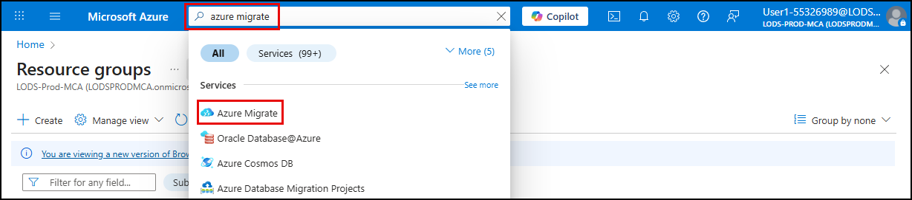

## Task 01: Create a new migration project

### Introduction
Terra Firm Laboratories is ready to turn "we should move to Azure" into an actual plan Dennis can track and defend. An Azure Migrate project becomes the team's home base for discovery, assessment, and migration decisions-so everyone is working from the same inventory and the same assumptions.

### Description
In this task, you'll create a new Azure Migrate project in the Azure portal. You'll confirm the project exists and open it, so it is ready for appliance registration and discovery.

### Success criteria
- A new Azure Migrate project named **Migration-Project-@lab.LabInstance.Id** exists in the portal.
- You can open the project from **Azure Migrate > All projects** and see its Overview page.

### Key tasks
- Sign in to the Azure portal on the lab VM using the provided lab credentials.
- Create a new Azure Migrate project in the **AZMigrateRG** resource group with the specified project name.
- Open the project from **All projects** and confirm it is accessible.

1. Sign into the Lab VM using **Passw0rd!** as the password.

    {: .note }
    > Your Lab VM also serves as the Hyper-V host machine throughout this workshop.

1. Open a web browser on the Lab VM and navigate to **portal.azure.com**.

1. Sign in using your lab's Azure credentials. 

    | Item | Value |
    |:--------|:--------|
    | Username   | **@lab.CloudPortalCredential(User1).Username**   |
    | TAP  | **@lab.CloudPortalCredential(User1).AccessToken**   |

1. Select **Yes** if prompted to stay signed in.

1. In the Azure portal, search for **Azure Migrate** in the search bar and select **Azure Migrate** under **Services**.

    

1. On the **Azure Migrate** blade, select **Create Project**.

	

1. On the **Create Project** blade, enter the following:
	
    | Object | Value |
    | -------- | -------- |
    | Subscription | **Accept the default** |
    | Resource group | **AZMigrateRG** |
    | Project name | **Migration-Project-@lab.LabInstance.Id** |
    | Geography | **United States** |

1. Select **Create**.

1. After project creation completes, select **All projects** on the left menu, and then select the **Migration-Project-@lab.LabInstance.Id** project.

---

#### Congratulations!

You created an Azure Migrate project that will store discovery, assessment, and migration metadata for the rest of the lab, and then confirmed you can open it successfully.
