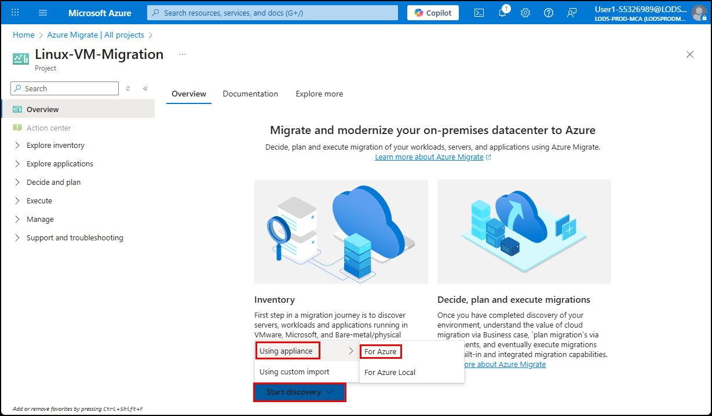
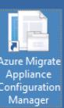
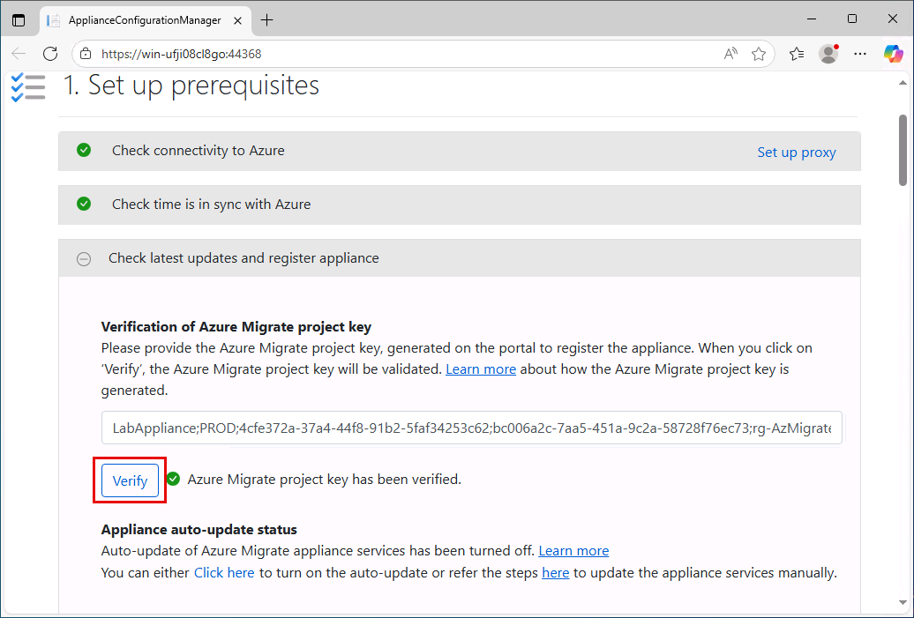
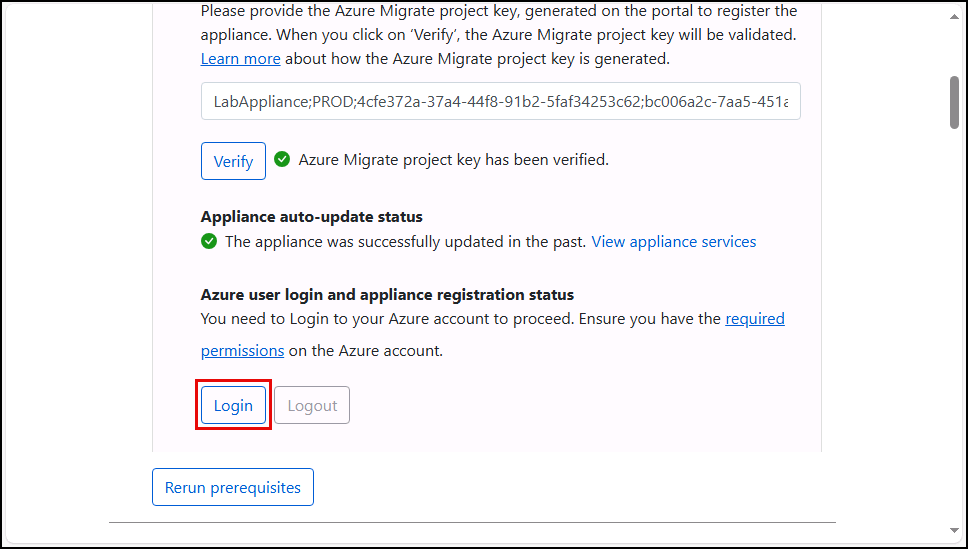
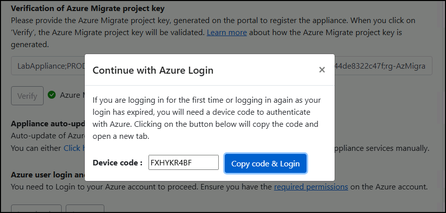
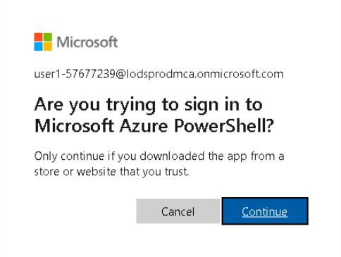

## Task 02: Register the Azure Migrate appliance

### Introduction
Before Terra Firm can estimate cost, downtime, or even a safe migration sequence, they need a clear picture of what's running on-premises. Registering the Azure Migrate appliance is how Dennis's team securely feeds Azure Migrate the facts-so the pilot workload can be assessed with real data instead of guesses.

### Description
In this task, you'll generate a project key from the Azure Migrate project and use it to register the pre-deployed Azure Migrate appliance. You'll complete device sign in and confirm the appliance registration status.

### Success criteria
- A project key has been generated and recorded for later use.
- The appliance shows **successfully registered** in the Appliance Configuration Manager.

### Key tasks
- Start appliance-based discovery for **Hyper-V** and generate a **project key**.
- Open the Appliance Configuration Manager and verify the project key.
- Complete device sign in and confirm appliance registration completes successfully.

### Configure discovery on the Azure Migrate project

1. On the **Overview** page, select **Start Discovery**, choose **Using Appliance**, then **For Azure**.

    

1. On the **Discover** blade, under **Are your servers virtualized?**, select **Yes, with Hyper-V**.

1. In the Name your appliance field, enter **app@lab.LabInstance.Id**.

1. Select **Generate Key**.

    {: .note }
> After a minute or two, a **Project key** field will appear on the Discover screen. 

1. Copy the project key and then paste it in the text box below, for later use.

	 @lab.TextBox(ProjectKey)

    {: .warning }
> Do not download the Azure Migrate appliance VHD or ZIP file. The Azure Appliance has already been deployed in the lab environment.

1. Select **Close** to close the Discover blade.

### Configure the Azure Migrate Appliance

1. Minimize the browser and then locate and launch the **Azure Migrate Appliance Configuration Manager** on the lab desktop.

	

1. On the Terms of use pop-up, select **I agree**.

1. Under **Verification of Azure Migrate project key**, enter the project key that you copied earlier   `@lab.Variable(ProjectKey)`.

1. Select **Verify**.

    

1. Scroll to the **Azure user login and appliance registration status** section and select **Login**.

    

1. In the pop-up window, select **Copy code & Login**.

    

1. Paste the **code**, and then select **Next**.

1. Choose the **@lab.CloudPortalCredential(User1).Username** user account. If prompted, sign in using **@lab.CloudPortalCredential(User1).Username** and **@lab.CloudPortalCredential(User1).AccessToken**.

1. Select **Continue**.

	

1. Close the sign-in window and return to the **Appliance Configuration Manager** browser tab.

{: .warning }
> The login and appliance registration process can take around 10 minutes. Please wait for this process to complete before continuing to the next task.

#### Congratulations! 
You generated a project key and successfully registered the Azure Migrate appliance to your project so it can upload discovery data.
