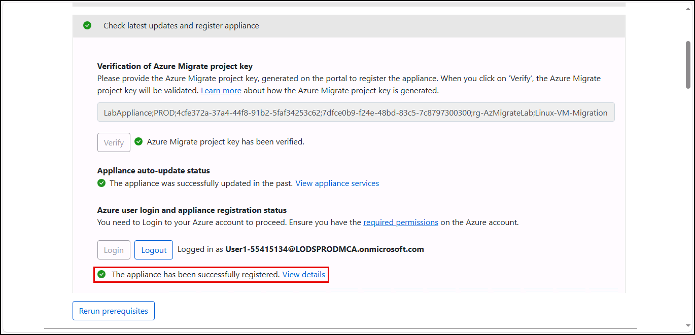
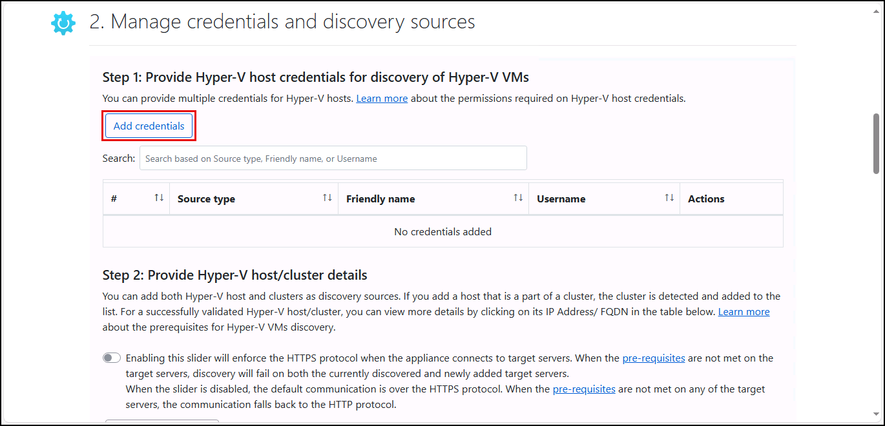
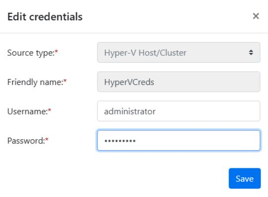
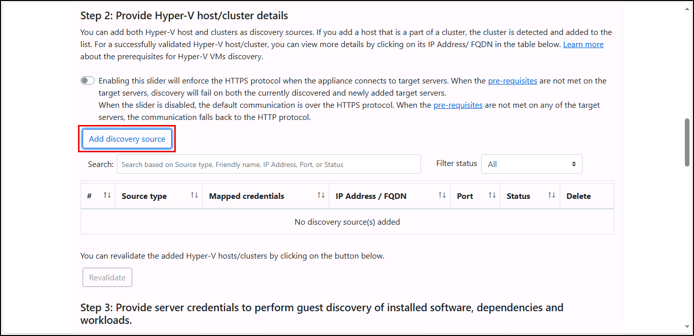
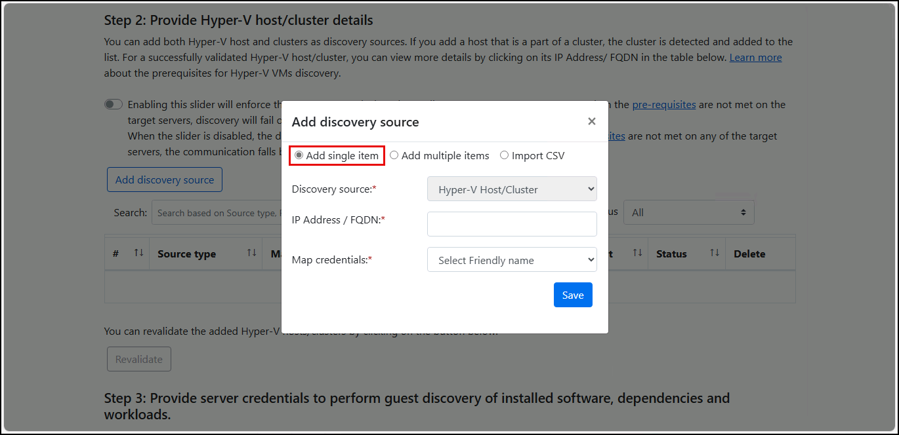
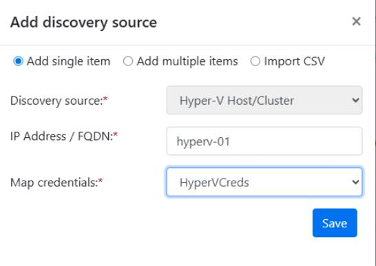
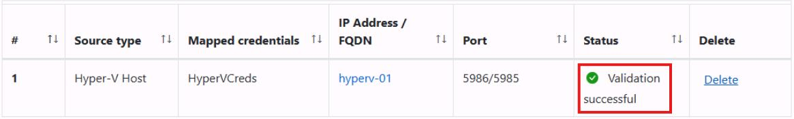
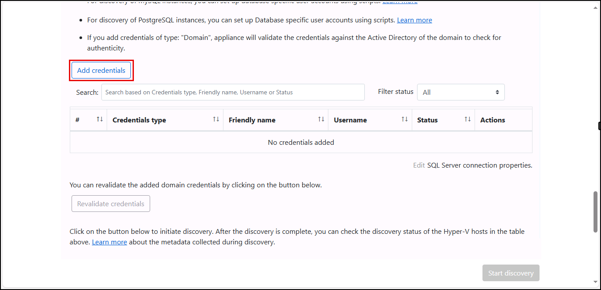

## Task 03: Discover virtual machines and workloads

### Introduction
Terra Firm's pilot workload is meant to represent what they'll migrate at scale: Linux servers plus a database tier and supporting components. Discovery (including guest discovery) helps surface the details that matter for migration decisions-what OS and workloads are installed, what depends on what, and what needs extra attention for security and operations once it lands in Azure.

### Description
In this task, you'll configure discovery sources and credentials for your Hyper-V environment and Linux/PostgreSQL guests. You'll start discovery and confirm the appliance validates access and begins discovering inventory.

### Success criteria
- Hyper-V host/cluster discovery source is added and shows **Validation successful**.
- Guest discovery credentials for **Linux** and **PostgreSQL** are saved.
- Discovery has started successfully and the project begins populating discovered inventory.

### Key tasks
- Add Hyper-V host credentials and register the Hyper-V host/cluster as a discovery source.
- Add guest discovery credentials for Linux and PostgreSQL workload discovery.
- Start discovery and verify validation/registration messages appear as expected.

1. On the **Appliance Configuration Manager** browser tab, verify you see a message that the appliance has been successfully registered.

    

1. Under **Manage credentials and discovery sources**, select **Add credentials** and then enter the following:

    | Object | Value |
    | -------- | -------- |
    | Source type | **Hyper-V Host/Cluster** |
    | Friendly name | **HyperVCreds** |
    | Username | **administrator** |
    | Password | **Passw0rd!** |

    

    

1. Select **Save**.

1. Under Provide Hyper-V host/cluster details, select **Add discovery source**.

    

1. In the **Add discovery source** dialog, select **Add single item**.

    

1. For the **IP address/FQDN**, enter **hyperv-01**.

1. Under **Map credentials**, select **HyperVCreds**, and then select **Save**.  
 
    

1. You should receive a **Validation successful** message within a minute or so.

    

1. After validation completes, under **Provide server credentials to perform guest discovery of installed software, dependencies, and workloads**, scroll down and select **Add credentials**.

    

1. In the **Add credentials** popup, enter the following:

    | Object | Value |
    | -------- | -------- |
    | Credentials type | **Linux (Non-domain)** |
    | Friendly name | **Linux** |
    | Username | **skilladmin** |
    | Password | **PurpleFrog3109!** |

1. Select **Add more** and add:

	| Object | Value |
    | -------- | -------- |
    | Credentials type | **PostgreSQL Server (Password based)** |
    | Friendly name | **PostgreSQL** |
    | Username | **admin** |
    | Password | **Password~1** |

1. Select **Save** to close the **Add credentials** dialog.

1. Scroll down and select the **Start Discovery** button.

	

{: .warning }
> Once the **Discovery** process begins, notify your instructor that you are ready to continue. 

#### Congratulations!
You configured discovery sources and credentials and started discovery so Azure Migrate can populate server inventory and detect workloads (web apps and databases).
