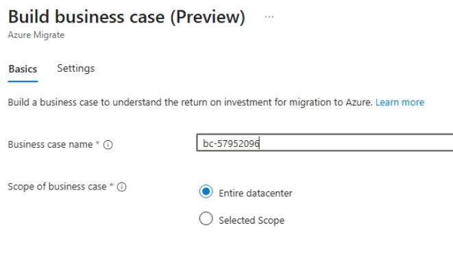
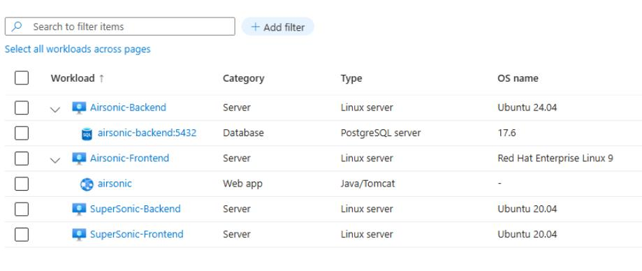

## Task 01: Build a business case and assessment

### Introduction
Dennis needs a lot more to get Terra Firm's cloud initiative funded - he needs a story backed by numbers. The business case turns discovered inventory into a cost-and-savings view, helping Terra Firm evaluate things like Azure Hybrid Benefit, operational savings, and what "moving efficiently" could actually look like.

### Description
In this task, you'll build a business case scoped to the environment and confirm it begins generating. While it runs, you'll explore the discovered inventory and validate that key workloads have been discovered.

### Success criteria
- A business case named **bc-@lab.LabInstance.Id** is created and visible under **Decide and Plan > Business cases**.
- Discovered inventory is visible in the project and includes the expected servers and workloads.

### Key tasks
- Start **Build business case** using the specified settings (target location, modernization preference, pricing assumptions).
- Open **Explore inventory** and validate discovered servers and discovered workloads (web app + database).
- Drill into at least one database workload and one web app workload to review details.

1. In the Azure portal, search for **Azure Migrate** in the search bar and select **Azure Migrate**, under **Services**.

    

1. On the **Azure Migrate** page, in the Azure portal, Select **All projects>Migration-Project-58172032** expand the **Decide and Plan** in the left menu, then select **Business cases**.

1. Select **Build business case**.

1. Enter **bc-@lab.LabInstance.Id** for the Business case name, select **Entire datacenter**, then select **Next** to continue.

	

1. On the **Build business case (Preview)** page, enter the following:

    | Object | Value |
    | -------- | -------- |
    | Target location | **@lab.CloudResourceGroup(AZMigrateRG).Location**| 
    | Migration preference | **Modernize**| 
    | Saving options| **Reserved Instance**| 
    | Discount (%) on Pay as you go | **0**| 
    | Currency | **US Dollar ($)**| 

1. Select **Build business case**.

	{: .note }
    > The business case will take approximately 10 minutes to generate. You can continue with the lab while it is generating.

	{: .note }
    > Building a business case automatically creates an assessment as well. You'll evaluate both when the generation is complete.

## Explore the discovered inventory

1. On the Azure Migrate blade, select **All projects**, and then select the **Migration-Project-@lab.LabInstance.Id** project.

1. On the left navigation menu, expand **Explore Inventory**.

1. Select **All inventory** and then observe the discovered objects.

    

1. Select the **>** next to **Airsonic-Backend** to display the discovered workloads.

1. Select **Databases**, and then select the **airsonic-backend** DB instance to observe the details.

1. Select **Close** to return to the previous screen.

1. select **All inventory**, select the **>** next to **Airsonic-Frontend** to display the discovered workloads. 

1. Select **Web apps** and then select the **airsonic** Web app to observe the details.

1. Select the **X** in the top right side of the screen, to return to the previous screen.

#### Congratulations! 
You initiated a business case for the environment and verified the discovered inventory contains the expected servers and workload objects used for planning.