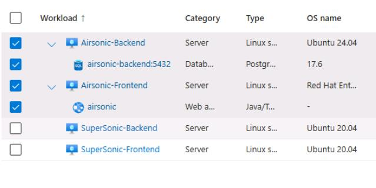
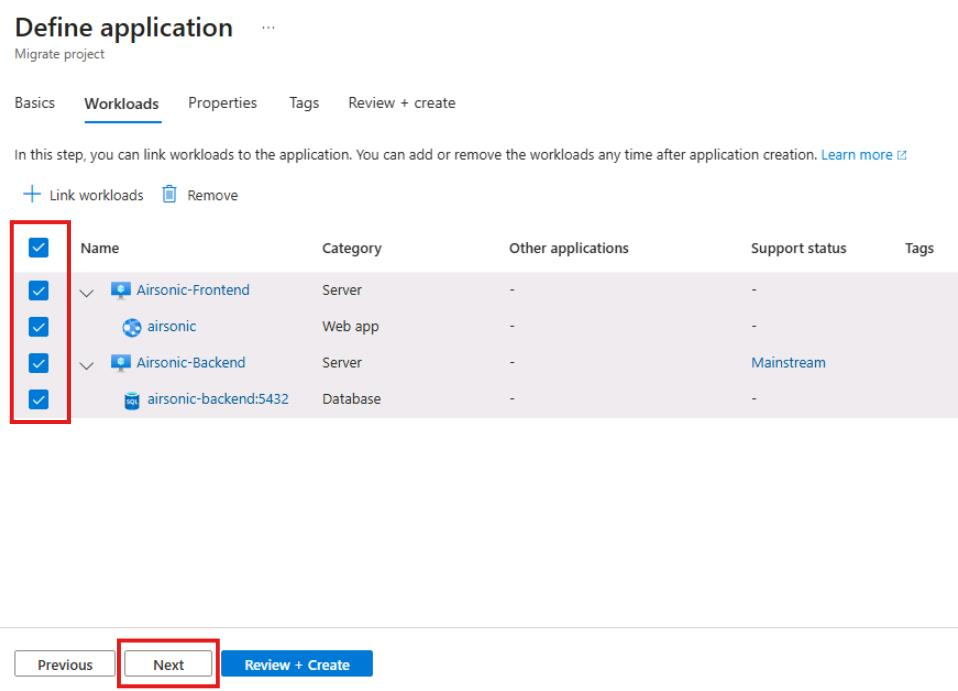

## Task 02: Define an application for the Airsonic stack

### Introduction
Terra Firm isn't migrating "random servers" - they're migrating a workload that users rely on, with tiers that rise and fall together. Defining the application lets Dennis's team treat the pilot as a single unit (web/app/database), making it easier to plan dependencies, choose a target approach, and avoid migrating pieces out of order.

### Description
In this task, you'll create an application definition for the Airsonic stack by linking the frontend and backend servers and their discovered workloads (Tomcat web app and PostgreSQL database). You'll also set basic app properties such as business criticality and complexity.

### Success criteria
- An application named **airsonic-app-@lab.LabInstance.Id** exists in **Explore applications > Applications**.
- The application includes the linked Airsonic servers and their discovered workloads.

### Key tasks
- Create a new **Custom** application definition from **Explore applications > Applications**.
- Link the Airsonic frontend and backend servers (ensuring workloads are included).
- Set business criticality/complexity values and create the application.

You're grouping the Airsonic Frontend + Backend + discovered workloads (Tomcat + PostgreSQL) into one "application" so you can assess, plan waves, and make PaaS vs IaaS decisions as a stack.

1. In the left menu under **Explore applications**, select **Applications**.

1. Select **+ Define application**.

1. For the Name, enter **airsonic-app-@lab.LabInstance.Id**.

1. For the description, enter **Airsonic application consists of a front end Java/Tomcat app and a back end PostgreSQL database**.

1. For Type, select **Custom**.

1. Select **Next**.

1. Select **Link workloads**.

1. Select the checkboxes next to **Airsonic-Frontend** and **Airsonic-Backend**.

	{: .note }
    > Selecting the servers will also select the Web app and Database workloads.

    

1. Select **Add**.

1. On the Workloads tab, select **All four workloads**, and then select **Next**.

	

1. On the properties tab, enter the following:

    | Object | Value |
    | -------- | -------- |
    | Business criticality | **Medium** |
    | Complexity | **Medium** |
    | Publisher | **Blank** |
    | Technology stack | **Blank** |

1. Select **Review and Create**, and then select **Create**.

	{: .note }
    > Select **Refresh** until you see that the application has been created.

#### Congratulations! 
You grouped the Airsonic stack into a single application, including its servers and discovered workloads, so it can be assessed and planned as a unit.
