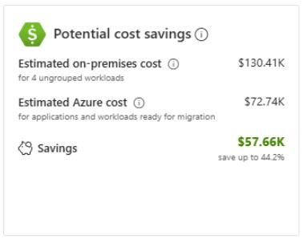
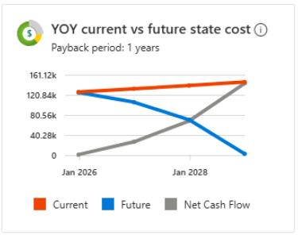
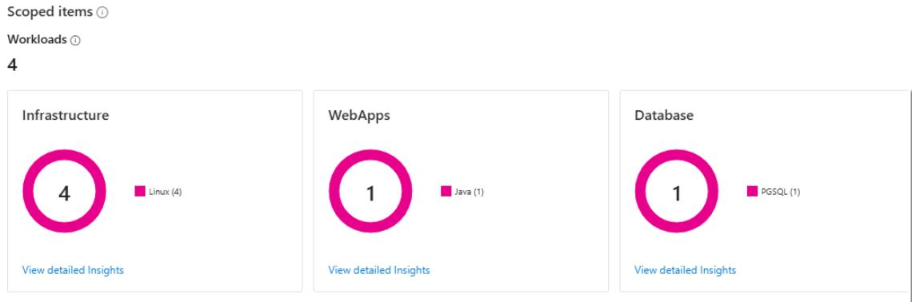
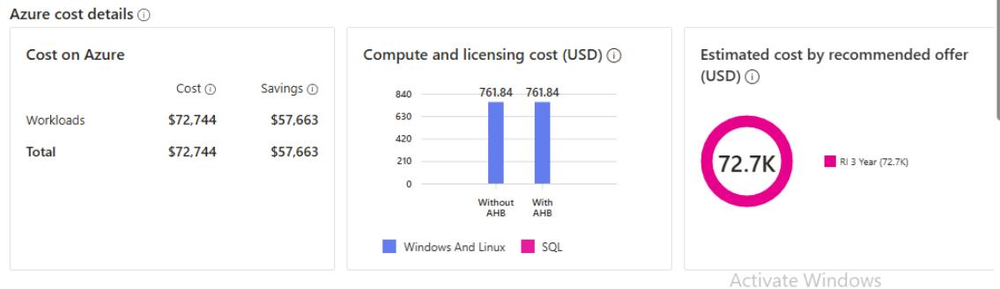
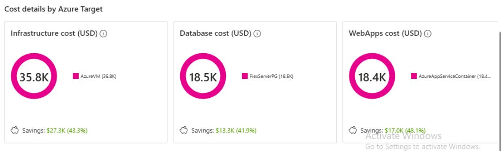

## Task 03: Review the Business Case outputs (scope, savings, and data quality)

### Introduction
Terra Firm's leadership will ask tough questions-especially about savings, scope, and whether the numbers are trustworthy. Reviewing the business case outputs helps Dennis confirm the pilot workload is correctly represented and that the cost/savings story is grounded in accurate discovery data (because "garbage in, garbage out" applies to cloud planning too).

### Description
In this task, you'll open the generated business case and review key outputs including scoped item counts, estimated costs and savings, and the migration strategy summary. You'll verify that the scope aligns with the discovered inventory.

### Success criteria
- Scoped item counts align with lab inventory (workloads, web apps, database).
- You can locate and interpret key cost and savings outputs and a migration strategy summary.

### Key tasks
- Open the business case overview and review costs, savings, and the YOY visualization.
- Verify scoped item counts match the discovered inventory in the lab.
- Review **Current on-premises vs future** and **Migration Strategies** reports and compare major outputs.

1. In the Azure Migrate project, under **Decide and Plan**, select **Business cases**.

	{: .warning }
    > The Business case generation must be complete before you can continue. If it has not completed, you must wait.

1. Select **bc-@lab.LabInstance.Id**.

1. On the **Overview** page, observe the **Potential cost savings**:

    - Estimated on-premises cost
    - Estimated Azure cost
    - Savings
    
    

1. On the **Overview** page, observe the **YOY current vs future state costs**:

	

1. Under **Scoped items**, verify that:
 
    - Workloads = **4**
    - WebApps = **1**
    - Database = **1**

	

1. On the left menu under **Business Case Reports**, select **Current on-premises vs future**.

1. Analyze the **On-premises vs Azure cost**.

1. Scroll down and compare the **Total cost of ownership** per object. 

1. On the left menu under **Business Case Reports**, select **Migration Strategies.** and then review the following sections:

    
    

1. Select the **X** in the top right corner to close the Business Case.

#### Congratulations!
You reviewed business case scope and cost outputs to understand projected on-prem vs Azure costs, savings, and strategy assumptions based on discovered data.
