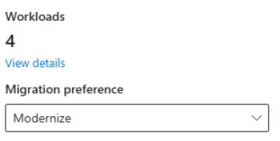
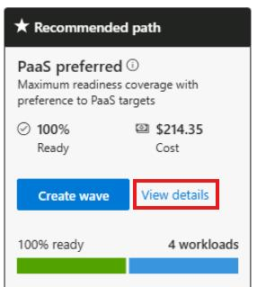
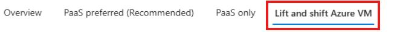

## Task 04: Review the Assessment created by the Business Case

### Introduction
Terra Firm wants options: lift-and-shift where it makes sense, but also modernization paths that reduce long-term work and improve security. The assessment translates discovery into readiness and recommendations, so Dennis can compare VM migration versus PaaS/container options and choose what best fits the pilot's needs.

### Description
In this task, you'll open the assessment created by the business case and compare recommendations across **PaaS preferred**, **PaaS only**, and **Lift and shift to Azure VM** views. You'll observe how targets and readiness differ by path.

### Success criteria
- The assessment shows **4 workloads** and uses the **Modernize** preference.
- You can identify the recommended target approach for the web app and database across the different paths.

### Key tasks
- Open the assessment produced by the business case and verify workload count and migration preference.
- Compare the migration paths across **PaaS preferred**, **PaaS only**, and **Lift and shift**.
- Use **View details** to identify the recommended target services for the app tier and database tier.

1. [] In the Azure Migrate project, under **Decide and Plan**, select **Assessments**.

1. [] Select the **businesscase-bc-@lab.LabInstance.Id** assessment.

1. [] Ensure that **4** Workloads are displayed and that the Migration preference is set to **Modernize**.

	

1. [] Compare the migration options between PaaS preferred, Paas only, and Lift and shift to Azure VM.

1. [] On the **Paas preferred** tile, select **View details**.

	

1. [] Observe the recommended migration path and readiness state:

	- Replatform the Web app to an App Service Container.
    - Replatform the PostgreSQL instance to Azure Database for PostgreSQL.
    - Rehost the two remaining Servers to Azure VMs.

1. [] On the top menu, select **Paas only**

	

1. [] Observe the recommended migration path and readiness state:

	- Replatform the Web app to AKS.
    - Replatform the PostgreSQL instance to Azure Database for PostgreSQL.
    - Rehost the two remaining Servers to Azure VMs.

1. [] On the top menu, select **Lift and shift Azure VM**.

1. [] Observe the recommended migration path and readiness state:

    

    - Rehost the all 4 Servers to Azure VMs.

1. [] Select the **X** in the top right corner to close the assessment page.

#### Congratulations! 
You compared modernization options and validated the recommended migration approach for the web app and PostgreSQL workload across PaaS and IaaS paths.
