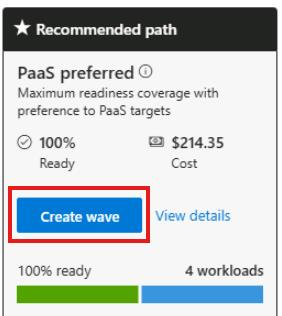
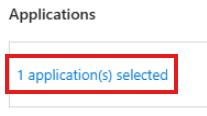
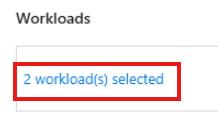
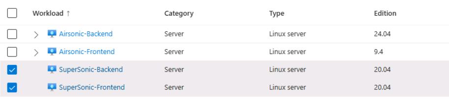
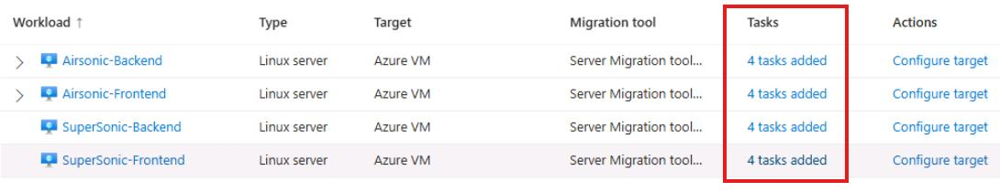
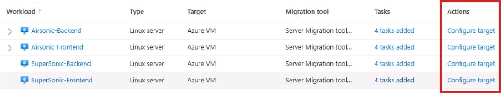

## Task 05: Create a wave plan using the recommended path

### Introduction
One of Terra Firm's biggest worries is downtime, so "move everything at once" is not ideale. Wave planning helps Dennis break migration into manageable phases, align tasks and dependencies, and create an execution plan that supports faster delivery *and* safer rollback decision points.

### Description
In this task, you'll create a wave from the assessment's recommended path and then review wave settings, tasks, selected applications/workloads, and target settings. You'll confirm the wave includes the Airsonic application and the discovered workloads.

### Success criteria
- A wave plan named **wave-@lab.LabInstance.Id** exists under **Decide and Plan > Wave planning**.
- The wave includes the Airsonic application and the expected workloads, and you can review its target settings and migration options.

### Key tasks
- Create a wave plan directly from the assessment's **Recommended path**.
- Add at least two custom tasks to the wave and save changes.
- Review application/workload selections, target settings, and migration options associated with the wave.

1. In the Azure Migrate project, under **Decide and Plan**, select **Assessments**.

1. Select the **businesscase-bc-@lab.LabInstance.Id** assessment.

1. On the **Recommended path** tile, select **Create wave**.

	

1. On the **Applications and workloads** popup, select **OK**.

1. For the Wave name, enter **wave-@lab.LabInstance.Id**.

1. For the planned start date, leave the **default**.

	{: .note }
    > You do not need to add workloads to the wave plan since we are using the assessment that was already created.

1. Select **Create wave**.

	{: .note }
    > It will take several minutes to create the wave. If you receive an error during the creation, you can safely ignore it.

1. Select the **X** in the top right corner to close the assessment page.

1. In the Azure Migrate project, under **Decide and Plan**, select **Wave planning**.

1. Select the **wave-@lab.LabInstance.Id** wave plan.

	{: .warning }
    > If you receive a warning regarding the Hyper-V replication appliance, you can safely ignore it. You'll configure this in a later exercise.

1. On the overview page, observe the settings and options.

1. On the left menu, select **Wave settings**.

1. At the bottom of the page select **+ Add Task**.

1. For the Task name, enter **Airsonic migration**, and then select **Add**.

1. Select **+ Add Task** again.

1. For the Task name, enter **Linux VM migration**, and then select **Add**.

1. Select **Save changes** at the bottom of the window.

1. On the left menu, select **Applications and workloads**.

1. Under Applications, select **1 application(s) selected**.

	

	{: .note }
    > You should see the airsonic app that you defined earlier.

1. Select the **X** in the top right side of the window, to close the application window.

1. Under Workloads, select **2 workload(s) selected**.

	

	{: .note }
    > You should see the 4 servers, with both Supersonic servers selected.

    

1. Select the **X** in the top right side of the window, to close the select workloads window.

1. On the left menu, select **Target settings**.

1. Review the Tasks associated with each workload.

	

1. Review the **Target settings** associated with each workload.

	

1. On the left menu, select **Migrations**, and review the available options.

#### Congratulations! 
You created a wave plan from the assessment, added tasks, confirmed included applications/workloads, and reviewed target settings and migration options for execution planning.
