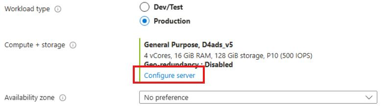
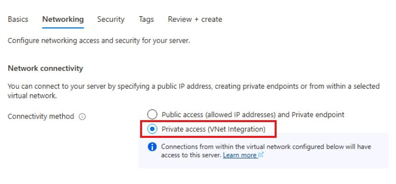

## Task 01: Create the Azure Database for PostgreSQL flexible server

### Introduction
For the pilot workload, Terra Firm wants to reduce management overhead and tighten security, especially with concerns about zero-day threats. Moving PostgreSQL to Azure Database for PostgreSQL Flexible Server gives Dennis's team a managed database foundation with built-in platform capabilities, while private access helps keep traffic off the public internet.

### Description
In this task, you'll deploy a PostgreSQL flexible server using private access (VNet integration). You'll configure compute, authentication, and networking so the application can connect privately after migration.

### Success criteria
- The PostgreSQL flexible server **pgsql-flex-@lab.LabInstance.Id** is deployed successfully.
- The server is configured with **Private access (VNet Integration)** and the expected VNet/subnet.

### Key tasks
- Create a PostgreSQL flexible server with the specified name, version, and compute sizing.
- Configure **Private access (VNet integration)** networking using the lab VNet/subnet.
- Confirm the deployment completes successfully before proceeding.

1. On the Lab VM, return to the Azure portal **https://portal.azure.com**.

1. In the Azure portal search bar, search for and then select **Azure Database for PostgreSQL flexible servers**.

1. Select **+ Create**

1. On the New Azure Database for PostgreSQL flexible server, enter the following:

    | Object | Value |
    | -------- | -------- |
    | Resource group | **AZMigrateRG** |
    | Server name | **pgsql-flex-@lab.LabInstance.Id** |
    | Region | **@lab.CloudResourceGroup(AZMigrateRG).Location** |
    | PostgreSQL version | **17** |
    | Workload type | **Production** |

1. Under **Compute + storage**, select **Configure server**.

	

1. Under **Compute size**, select **Standard_D2ads_v5 (2 vCores, 8 GiB memory, 3200 max iops)**.

	

1. Select **Save** and then configure the following:

    | Object | Value |
    | -------- | -------- |
    | Zone resiliency | **Disabled** |
    | Authentication method | **PostgreSQL authentication only** |
    | Administrator login | **pgadmin** |
    | Password | **Password~1** |

1. Select **Next : Networking >**.

1. Select **Private access (VNet Integration)**.

	

1. In the Virtual network section, ensure that the selected Virtual Network is **migrate@lab.LabInstance.Id**.

1. Next to **Subnet**, select **migrate@lab.LabInstance.Id/flex_server_subnet (192.168.100/128/26)**.

	{: .warning }
    > Please ensure that you choose the correct subnet above. Not choosing the correct subnet will cause late exercises to fail.

1. Select **Next : Security >**.

1. Select **Next : Tags >**.

1. Select **Next : Review + create >**

1. Select **Create**.

{: .note }
> It will take approximately 8-10 minutes for the deployment to complete. You can continue to the next task while it deploys.

#### Congratulations! 
You deployed a PostgreSQL Flexible Server using private access so the database tier can be modernized to a managed service within the lab VNet.
