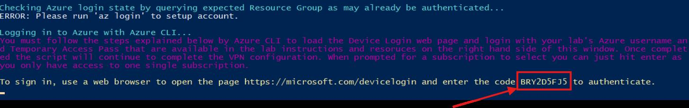

## Task 02: Connect the Site-to-Site VPN

### Introduction
Terra Firm doesn't want sensitive database traffic exposed, and they prefer private endpoints whenever possible. Establishing VPN connectivity gives the lab environment a secure path into Azure so the team can reach private resources (like the PostgreSQL service) during migration and validation-without punching public holes in the design.

### Description
In this task, you'll run the provided PowerShell script to establish VPN connectivity. You'll authenticate using device sign in and confirm the connection remains active for subsequent steps.

### Success criteria
- Device sign in authentication completes successfully for the VPN connection.
- The VPN connection remains active for later tasks that require private connectivity.

### Key tasks
- Run the VPN automation script from the desktop and start device sign in.
- Complete authentication in the browser using the provided code.
- Confirm the script completes and keep the VPN session available for later steps.

1. Minimize the browser and locate the **HV-AutomateClientVPNSconnect.ps1** file on the desktop.

    

1. Right select on the file and then select **Run with PowerShell**.

1. Wait until you see the prompt to sign in using a web browser. **Copy the code** from the PowerShell window.

	

1. Open a new browser tab and connect to **microsoft.com/devicelogin**.

1. **Paste the code**, and then select **Next**.

1. Select **@lab.CloudPortalCredential(User1).Username**, and then select **Continue**.

1. Once signed in, close the browser tab and return to the PowerShell window.

1. At the Select a subscription prompt, select **Enter** to use the default.

	{: .note }
    > You can safely minimize the PowerShell window while it connects the VPN.

#### Congratulations! 
You established hybrid connectivity from the lab environment to Azure so private endpoints and internal Azure resources can be reached during migration and validation.
