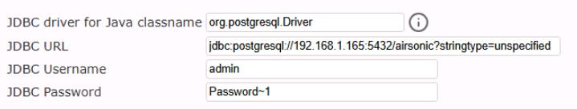
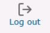

## Task 03: Validate and customize the application data

### Introduction
Terra Firm's stakeholders will ask, "How do we know nothing changed after migration?" A simple pre-migration marker (like a unique playlist) makes post-migration validation quick and undeniable-and checking the current database settings gives Dennis a clean "before" snapshot to compare against after cutover.

### Description
In this task, you'll log in to Airsonic, create a unique playlist name as a marker, and review the application's current database connection settings. You'll use this marker later to confirm migration success.

### Success criteria
- You can log in to Airsonic successfully.
- A unique playlist marker is created and visible in the UI.
- The current database endpoint is reviewed and understood as the pre-migration baseline.

### Key tasks
- Open Airsonic and authenticate using the provided lab credentials.
- Create a unique playlist (or rename one) as a post-migration validation marker.
- Review the **Settings > Database** page to confirm the current DB endpoint.

#### Connect to the Airsonic application

1. Open a new browser tab and connect to **http://airsonic-frontend:8080/airsonic**.

1. Login using **admin** for the username and **admin** for the password.

#### Cutomize the interface in order to identify the database after the migration.

1. On the left menu under **Playlists**, select **Create new playlist**.

1. Select the newly create playlist (the name will default to today's date).

1. Select **Edit**, and then enter a **Unique name** for the playlist, select **Save**.

	{: .warning }
    > It may take a minute before you are able to select the **Edit** option, please be patient. 

1. In the top menu, select **Settings**, and then select **Database**.

	{: .note }
    > Notice that the application is currently pointing to 192.168.1.165 for the PostgreSQL database. That is the address of the on-prem server hosting the database.

    

1. In the top right corner, select **Log out**.

	

1. Close the airsonic browser tab.

1. Return to the Azure portal and confirm that your PostgreSQL Flexible Server deployment is complete.

	{: .note }
    > If the deployment has not completed, wait for it to finish before you continue to the next step.

#### Congratulations! 
You created an identifiable marker in the application and confirmed the pre-migration database endpoint so you can clearly validate the migration outcome later.
