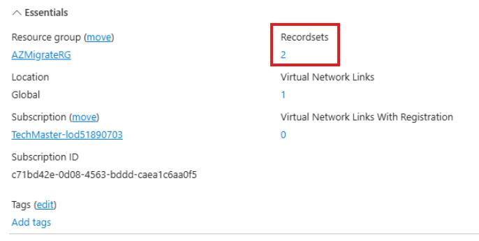

## Task 04: Retrieve the internal IP address of the Flexible PostgreSQL server

### Introduction
Because Terra Firm is using private access, the database endpoint needs to resolve correctly inside the private network - not out on the public internet. Pulling the internal IP (via Private DNS) helps the team confirm name resolution and connectivity are behaving as intended before they point production-like workloads at the new database.

### Description
In this task, you'll locate the private DNS record for the flexible server and record the internal IP address. This value will be used for application connectivity configuration later in the lab.

### Success criteria
- The private DNS record for the flexible server is located successfully.
- The flexible server internal IP address is recorded in the lab textbox.

### Key tasks
- Open **Private DNS zones** and locate the zone/records related to the flexible server.
- Identify the **A record** for the flexible server and record its IP address.
- Store the IP address for use in subsequent configuration steps.

1. In the Azure portal search bar, search for and then select **Private DNS zones**.

1. Select the Private DNS zone that begins with **pgsql-flex-@lab.LabInstance.Id.xxxxxxxx**.

1. Select the number that appears under **Recordsets** (2).

	

1. Locate the record that appears as **Type A** and enter the value for the IP address in the text box below:

	 @lab.TextBox(FlexIP)

	{: .note }
    > This is the internal IP address assigned to the Flexible PostgreSQL server. You'll use this in a later exercise.

1. Select the **X** in the top right corner of the window, to close the Private DNS zone flyout.

#### Congratulations! 
You located the private DNS record for the flexible server and recorded its internal IP address for use in application configuration and connectivity validation.