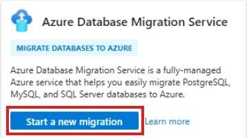
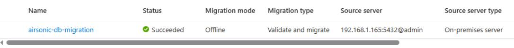

## Task 05: Validate and migrate the database

### Introduction
Dennis wants to accelerate migration, but not by skipping safety checks. Running validation first helps Terra Firm catch problems early (permissions, connectivity, compatibility) so the actual migration is smoother, and it supports the customer's rollback concerns by reducing the chance of a failed cutover.

### Description
In this task, you'll run a validation migration job, review results for errors, and then run an offline database migration to PostgreSQL flexible server. You'll monitor both jobs until they succeed.

### Success criteria
- The validation job completes successfully with no blocking errors.
- The migration job completes with status **Succeeded** for the Airsonic database.

### Key tasks
- Create and run a **Validate** migration job using the Migration Service for PostgreSQL.
- Review validation output for errors/warnings and confirm readiness.
- Create and run a **Validate and migrate** offline migration job and monitor status to completion.

#### Validate the database migration

1. In the Azure portal search bar, search for and then select **Azure Database Migration Services**.

1. On the **Azure Database Migration Services** page, select **Start a new migration**.

	

1. On the **Select migration scenario and Database Migration Service** page, enter the following:

    | Object | Value |
    | -------- | -------- |
    | Source server type | **PostgreSQL** |
    | Target server type | **Azure Database for PostgreSQL** |
    | Database Migration Service | **Migration Service for Azure Database for PostgreSQL** |
    | Subscription | **@lab.CloudSubscription.Name** |
    | Resource Group | **@lab.CloudResourceGroup(AZMigrateRG).Name** |
    | Azure Database for PostgreSQL | **pgsql-flex-@lab.LabInstance.Id** |

1. Select **Go to target server**.

1. On the pgsql-flex-@lab.LabInstance.Id | Migration page, select **+ Create**.

1. On the **Setup** tab, enter the following values:

    | Object | Value |
    | -------- | -------- |
    | Migration name | **airsonic-db-validation** |
    | Source server type | **On-premises server** |
    | Migration option | **Validate** |
    | Migration mode | **Offline** |

1. Select **Next: Runtime server >**

1. Next to Use runtime server, select **Yes** and then enter the following:

    | Object | Value |
    | -------- | -------- |
    | Subscription | **@lab.CloudSubscription.Name** |
    | Resource Group | **@lab.CloudResourceGroup(AZMigrateRG).Name** |
    | Server name | **pgsql-flex-@lab.LabInstance.Id.postgres.database.azure.com** |

	{: .warning }
    > If the Next : Source server > icon appears greyed out. Reselect the three options about and it should become available.

1. Select **Next : Source server >**.

1. On the **Source server** tab, enter the following values:

    | Object | Value |
    | -------- | -------- |
    | Server name | **192.168.1.165** |
    | Port | **5432** |
    | Administrator login | **admin** 
    | Password | **Password~1** |
    | SSL mode | **Prefer** |

1. Select **Connect to source** and confirm the connection.
    
1. Select **Next: Target server >**.

1. On the Target server tab, in the Password field, enter **Password~1**, and then select **Connect to target**.

1. Wait for the **Connection successful** message, and then select **Next: Databases to validate or migrate >**.

1. On the **Databases to validate and migrate** tab, select **airsonic**, and choose **Next: Summary >**.

1. On the **Summary** tab, review the configuration and select **Start validation**.

	{: .note }
    > It will take several minutes to complete the validation. You can periodically refresh the page until the Status displays **Succeeded**.

1. Once the validation is complete, select the **airsonic-db-validation** job.

1. Inspect the results of the validation and confirm that there are no errors.

1. Scroll to the bottom and select the **airsonic** database.

1. Inspect the flyout page for any errors, and then select the **X** in the top right to close the flyout.

1. Select the **X** in the top right corner to close the validation results page.

#### Migrate the database

1. On the pgsql-flex-@lab.LabInstance.Id | Migration page, select **+ Create**.

1. On the **Setup** tab, enter the following values:

    | Object | Value |
    | -------- | -------- |
    | Migration name | **airsonic-db-migration** |
    | Source server type | **On-premises server** |
    | Migration option | **Validate and migrate** |
    | Migration mode | **Offline** |

1. Select **Next: Runtime server >**

1. Next to Use runtime server, select **Yes** and then enter the following:

    | Object | Value |
    | -------- | -------- |
    | Subscription | **@lab.CloudSubscription.Name** |
    | Resource Group | **@lab.CloudResourceGroup(AZMigrateRG).Name** |
    | Server name | **pgsql-flex-@lab.LabInstance.Id.postgres.database.azure.com** |

	{: .warning }
    > If the Next : Source server > icon appears greyed out. Reselect the three options about and it should become available.

1. Select **Next : Source server >**.

1. On the **Source server** tab, enter the following values:

    | Object | Value |
    | -------- | -------- |
    | Server name | **192.168.1.165** |
    | Port | **5432** |
    | Administrator login | **admin** 
    | Password | **Password~1** |
    | SSL mode | **Prefer** |

1. Select **Connect to source** and confirm the connection.
    
1. Select **Next: Target server >**.

1. On the Target server tab, in the Password field, enter **Password~1**, and then select **Connect to target**.

1. Wait for the **Connection successful** message, and then select **Next: Databases to validate or migrate >**.

1. On the **Databases to validate and migrate** tab, select **airsonic**, and choose **Next: Summary >**.

1. On the **Summary** tab, review the configuration and select **Start validation and migrate**.

1. Monitor the progress of the migration on the **Migration** page.

	{: .note }
    > The migration should take approximately 5 minutes. The migration is complete when the status displays **Succeeded**. You can periodically **refresh** to update the status.

    

#### Congratulations! 
You validated the migration, reviewed results, and completed an offline database migration to PostgreSQL Flexible Server with a successful status.
