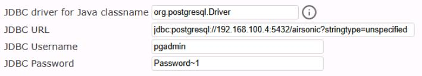

## Task 06: Verify the database migration

### Introduction
A successful migration isn't "the tool said Succeeded" - it's "the app still works and the data is intact." This verification step lets Terra Firm prove the pilot workload is using the new Azure database and that the pre-migration marker data is still there, exactly the kind of confidence Dennis needs before scaling this approach to more workloads.

### Description
In this task, you'll update the Airsonic configuration to point to the migrated database, reboot the application server, and verify the app works and displays the pre-migration marker data.

### Success criteria
- The Airsonic app starts successfully after configuration changes and reboot.
- You can log in and confirm the pre-migration marker (playlist) is present.
- The database settings reflect the new database endpoint after migration.

### Key tasks
- Update the Airsonic database connection configuration to use the flexible server endpoint.
- Reboot the Airsonic server and wait for the service to become available.
- Log in to Airsonic and confirm functionality and expected data after migration.

#### Point the on-prem airsonic web server to the newly migrate database 

1. Minimize the browser, and then locate and launch the **PuTTy** application from the desktop. 

1. In the **Host Name (or IP address)** field, enter **airsonic-frontend**, and then select **Open**.

1. On the **PuTTY Security Alert** pop-up, select **Accept**.

1. Login using **skilladmin** and **PurpleFrog3109!** (the password will not display on the screen).

1. Edit the airsonic configuration file to point to the newly migrated database by running the following command:

	```
    sudo nano /var/airsonic/airsonic.properties
    ```
    
1. Locate the **DatabaseConfigEmbedUrl=jdbc:postgresql://192.168.1.165:5432/airsonic?stringtype=unspecified** line and change only the IP address to **@lab.Variable(FlexIP)**.

1. In the line below, change the username from admin to **pgadmin** (the admin account that you created for the Azure database).

1. Save the file by selecting **Ctrl + X** and then select **Y** to save the modified buffer.

1. Select **Enter** to save the file.

1. Reboot the airsonic web server by entering **sudo reboot**.

1. On the **PuTTY Fatal Error** popup, select **OK**, and the close the PuTTY window.

#### Test the database migration

1. Open a new browser tab and connect to **http://airsonic-frontend:8080/airsonic**

	{: .note }
    > It may take a few minutes for the server to reboot and the site to become available.

1. Login using **admin** for the username and **admin** for the password.

1. Verify that the playlist that you created prior to the migration appears on the left side.

1. In the top menu, select **Settings**, and then select **Database**.

	{: .note }
    > Observe that the application is pointing to @lab.Variable(FlexIP) as IP address for the PostgreSQL database. That is the IP address of the Flexible PostrgeSQL server that you recorded earlier.

    

1. Close the airsonic browser tab.

#### Congratulations! 
You repointed the application to the migrated database and confirmed the app still works and retains expected data, validating a successful cutover.
