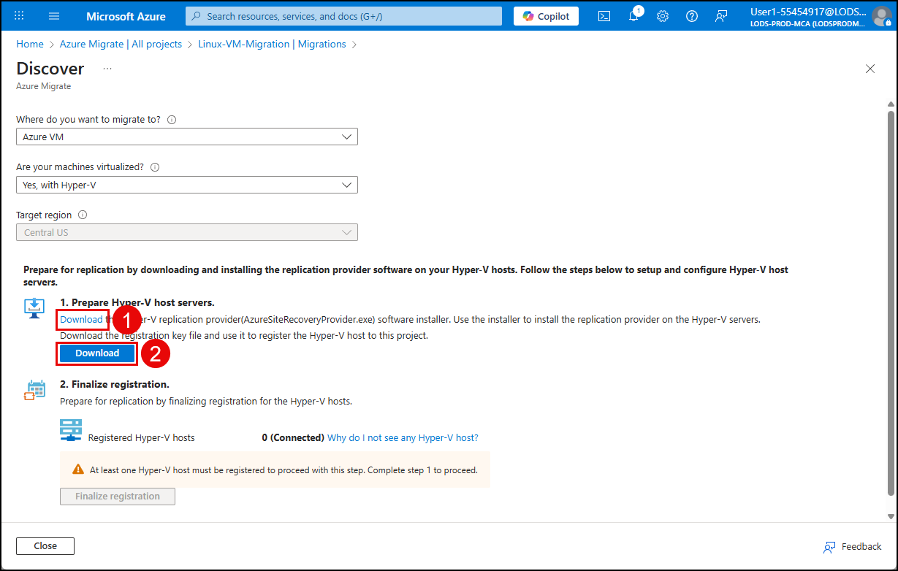
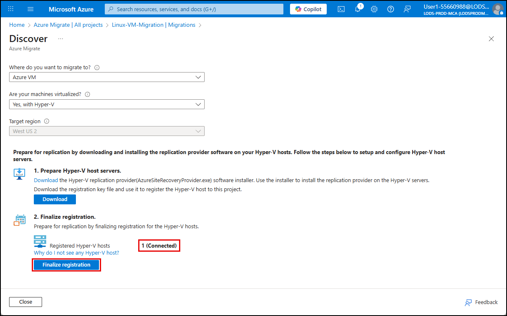
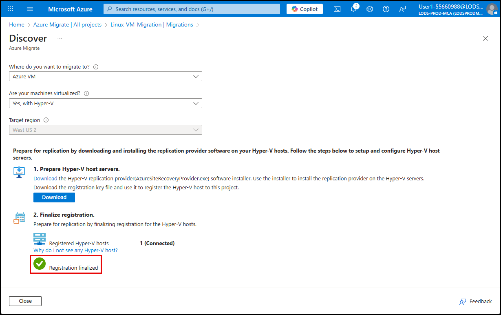
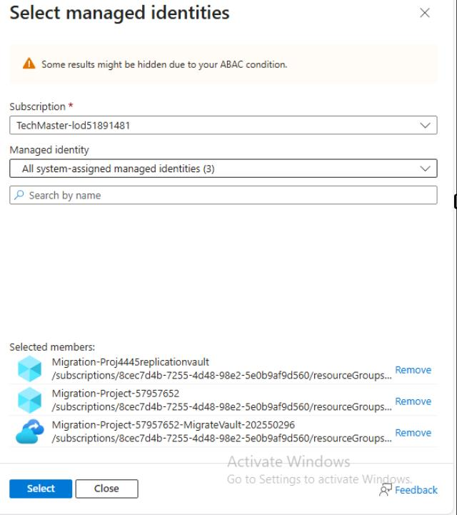
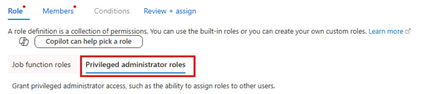

## Task 01: Prepare for replication

### Introduction
Not every Terra Firm workload will be modernized on day one-some systems need a clean lift-and-shift first to reduce risk and timeline. Preparing replication sets up Azure Migrate Server Migration so Dennis's team can continuously replicate a Linux VM to Azure, making the eventual cutover faster and less disruptive.
Azure Migrate Server Migration uses replication to copy Hyper-V VM data to Azure. Preparing for replication requires deploying supporting Azure resources, installing the replication provider on the Hyper-V host, and ensuring required permissions are in place.

### Description
In this task, you'll create the migration resources, install and register the Hyper-V replication provider, finalize registration in Azure Migrate, and configure access on the cache storage account so replication can proceed.

### Success criteria
- The Hyper-V host registration is finalized in Azure Migrate.
- Migration resources (vault and related components) are created successfully.
- Required permissions are configured so the vault/service can access the cache storage account.

### Key tasks
- Deploy migration resources for Hyper-V replication and download provider + vault credentials.
- Install the replication provider on the Hyper-V host and register it using the downloaded credentials file.
- Enable required identities/permissions and grant RBAC roles on the cache storage account.

1. Connect to the HyperV host by using the HyperV-01 Host.rdp icon.

	

1. Login using **administrator**,select **OK** and **Passw0rd!**, select **OK**.

1. Open a web browser on the HyperV-01 Host and navigate to **portal.azure.com**.

1. Sign in using your Azure credentials. 

1. Select **Yes** if prompted to stay signed in.

1. In the Azure portal, search for **Azure Migrate** in the search bar and select **Azure Migrate** under **Services**.

    

1. On the Azure Migrate blade, select **All projects**, and then select the **Migration-Project-@lab.LabInstance.Id** project.

1. Expand **Execute** in the left menu, select **Migrations**, and on the Migration blade, select **Discover more**.

    

1. On the **Discover** blade:

    | Object | Value |
    | -------- | -------- |
    | Where to you want to migrate to? | **Azure VM** |
    | Are your machines virtualized? | **Yes, with Hyper-V** |
    | Target region | **@lab.CloudResourceGroup(AZMigrateRG).Location** |

1. Check the box for **Confirm that the target region for migration is @lab.CloudResourceGroup(AZMigrateRG).Location**.

1. Select **Create resources**.

1. When the deployment completes, under **1. Prepare Hyper-V host servers**, select the **Download** link to download the Hyper-V replication provider software installer.

1. Select the **Download** button to download the registration key.

    

    {: .warning }
    > The files must be downloaded on the HyperV host, not the Migrate01 VM.

1. In the downloads dropdown, hover over **AzureSiteRecoveryProvider.exe**, and the select **Open file**.

1. In the **Microsoft update** page, select **Off**, and then select **Next**.

1. Keep the defaults and select **Install**.

1. Select **Register** and on the **Vault SettingsPrepare for replication** screen, select **Browse**

1. On the left menu, select the **Downloads** folder and then select the **Migration-Project-@lab.LabInstance.Id.Location-MigrateVault-@lab.LabInstance.Id_Migration-Project-@lab.LabInstance.Id-HyperVSite_xxxxxxx.VaultCredentials** file.

1. Select **Open**.
   
1. Select **Next**.

1. Select **Connect directly to Azure Site Recovery without a proxy server** and select **Next**.

1. Configuration Azure Site Recovery for registration will take one or two minutes to install. When it completes, select **Finish**.

1. Return to the **Discover** page in the Azure portal and **refresh the browser page**.

1. Select **Azure VM** under **Where do you want to migrate to?** and **Yes, with Hyper-V** under **Are your machines virtualized?** to reload the previous discover page.

    > You should see that you have one connected registration.

1. Select **Finalize registration**.

    

    > This step may take up to 3 minutes.

1. After the registration completes, verify you see the registration finalized message.

    

1. Select **Close** on the **Discover** page.

1. Close the RDP connection to return to the Migrate01 VM.

	

1. On the **Your remote session will be disconnected** pop up, select **OK**.

#### Configure permissions

1. In the Azure portal search bar enter and then select **Recovery Services vaults**.

1. Select the **Migration-Project-@lab.LabInstance.Id-MigrateVault-XXXXXX**.

1. Under **Settings**, select **Identity**.

1. On the **System assigned** page, set the Status to **On**, and then select **Save**.

1. On the **Enable system assigned managed identity** popup, select **Yes**.

1. In the Azure portal search bar enter and then select **storage accounts**.

1. Select the **sto@lab.LabInstance.Id** storage account.

1. On the left menu, select **Access Control (IAM)**.

1. Select **+ Add** > **Add role assignment**.

1. In the search field enter **Storage Blob Data Contributor**, and then **select the role**.

1. Select **Next**.

1. Under **Assign access to**, select **Managed Identity**, and then select **+ Select members**.

1. On the **Select managed identities** flyout, under **Managed identity**, select **All system-assigned managed identities (3)**.

1. Select the **all** identities, and then select **Select**.

	

1. Select **Review + assign** twice.

1. Select **+ Add** > **Add role assignment** again.

1. Select the **Privileged administrator roles** tab.

	

1. Select the **Contributor** role.

1. Select **Next**.

1. Under **Assign access to**, select **Managed Identity**, and then select **+ Select members**.

1. On the **Select managed identities** flyout, under **Managed identity**, select **All system-assigned managed identities (3)**.

1. Select the **all** identities, and then select **Select**.

1. Select **Review + assign** twice.

#### Congratulations! 
You prepared Azure Migrate Server Migration for Hyper-V by deploying required resources, registering the replication provider, and configuring permissions for replication.
