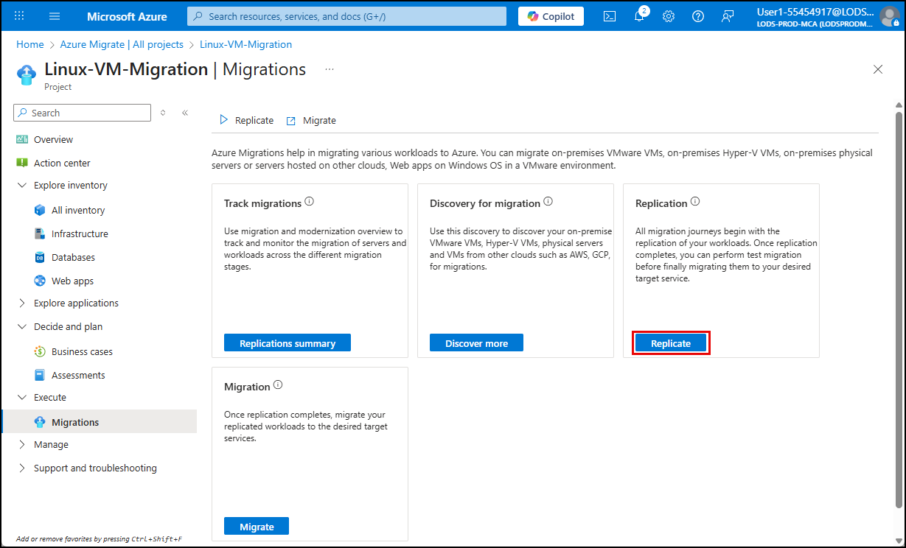
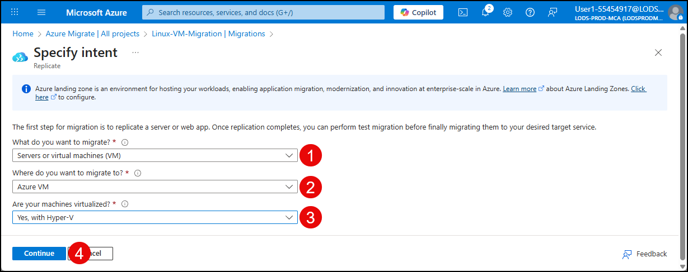
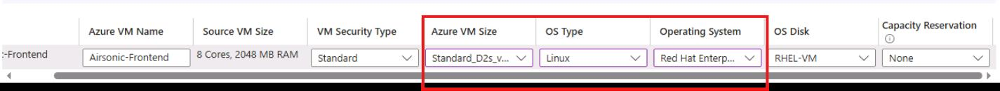
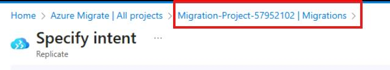

## Task 02: Replicate the RHEL VM (Airsonic-Frontend)

### Introduction
Terra Firm's downtime question is front and center: "How long will we be offline?" Replication is one of Dennis's best answers - by keeping Azure up to date with ongoing changes, the team can cut over using the latest data instead of doing a massive copy during the outage window.

### Description
In this task, you'll start replication for the Airsonic-Frontend VM, apply assessment-based settings, and monitor progress until replication is in a protected state.

### Success criteria
- Replication is started for **Airsonic-Frontend**.
- Replication status reaches **Protected**.

### Key tasks
- Start the **Replicate** workflow for Hyper-V VMs and select assessment-based settings.
- Configure target settings (RG, VNet/subnet, cache storage, availability) and VM compute sizing.
- Monitor replication jobs until the VM shows **Protected**.

1. In the Azure portal, search for **Azure Migrate** in the search bar and select **Azure Migrate** under **Services**.

    

1. On the Azure Migrate blade, select **All projects**, and then select the **Migration-Project-@lab.LabInstance.Id** project.

1. Under **Execute**, in the left menu, select **Migrations**, and then the **Replicate** button.

    

1. On the **Specify intent** page, make these selections:

    1. What do you want to migrate? Choose **Servers or virtual machines (VM)**.

    1. Where do you want to migrate to? Select **Azure VM**.

    1. Are your machines virtualized? Select **Yes, with Hyper-V**.

    1. Select **Continue**.

    

1. On the **Replicate** virtual machines tab, make these selections:

1. Target VM security type: Choose **Standard or Trusted Launch Virtual machines**.

1.  Import migration settings from an assessment: select **Yes, apply migration settings from an Azure Migrate assessment**.

1.  Select assessment: Select the **businesscase-bc--@lab.LabInstance.Id** you created earlier.

1.  Check the box next to **Airsonic-Frontend**.

1.  Select **Next**.

	{: .note }
    > You can safely ignore the warnings and errors on this screen.

1. On the **Target settings** tab, make these selections:

    | Object | Value |
    | -------- | -------- |
    | Resource group | **AZMigrateRG** |
    | Register with SQL IaaS extension | **Uncheck**
    | I have an Enterprise Linux license | **Check** |
    | I confirm I have an eligible Enterprise Linux subscription to apply this Azure Hybrid Benefit | **Check** |
    | Cache storage account | **sto@lab.LabInstance.Id** |
    | Virtual network | **migrate@lab.LabInstance.Id** |
    | Subnet | **default** |
    | Availability options | **No infrastructure redundancy required** |

1. Select **Next**.

1. On the **Compute** tab select the following:

    | Object | Value |
    | -------- | -------- |
    | Azure VM Size | **Standard_D2s_v4 (2 Cores, 8 GB RAM)** |
    | OS Type | **Linux** |
    | Operating System | **Red Hat Enterprise Linux 9** |

	

1. Select **Next**.

1. On the **Disks** page, select **Next**.

1. On the **Tags** page, select **Next**.

1. On the **Review + Start replication** page, select **Replicate**.

	{: .note }
    > You'll be returned to the Specify intent page. It is not necessary to go through this process again. 

1. From the breadcrumbs menu at the top, select **Migration-Project-@lab.LabInstance.Id | Migrations**.

	

1. On the **Track migrations** tile, select **Replications Summary**.

1. On the left panel, expand **Migration**, and then select **Replications**.

1. Monitor the status of your replication job. You'll need to select **Refresh** occasionally.

	{: .note }
    > The replication will take approximately 30 minutes. The process is complete when the Replication status displays **Protected**.

#### Congratulations! 
You started replication for the Airsonic-Frontend VM using assessment-based settings and confirmed replication progressed to a protected state.