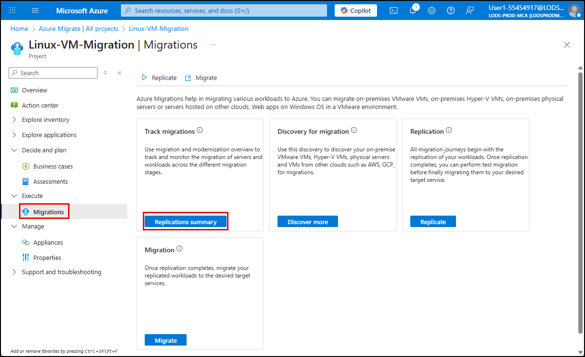

## Task 03: Migrate the RHEL VM

### Introduction
This is the "go time" moment Terra Firm worries about most - moving the workload without surprises. A planned migration uses the latest replicated data for a controlled cutover, helping Dennis demonstrate a predictable process and making it easier to justify scaling the approach across the rest of the environment.

### Description
In this task, you'll initiate a planned migration for the replicated Airsonic-Frontend VM and monitor the migration job until it completes.

### Success criteria
- A planned migration completes successfully for Airsonic-Frontend.
- The migrated VM is created in Azure and starts successfully.

### Key tasks
- Confirm replication is protected and initiate **Migrate** (planned failover) from the replication item.
- Approve shutdown of the on-premises VM for a no-data-loss cutover.
- Monitor the migration job until it completes successfully.

1. In the Azure portal, return to the **Migration-Project-@lab.LabInstance.Id** Project page, expand **Execute** in the left menu, select **Migrations**, and on the Migration blade, select **Replications summary**.

    

1. On the **Replications Summary** page, expand **Migration** in the left menu, select **Replications**, and observe the replication you started previously.

    {: .note }
    > The replication is complete when you see the replication status for the **Airsonic-Frontend** set to **Protected**.

1. Start the migration by selecting the ellipsis to the right of the **Airsonic-Frontend** item, and then select **Migrate** from the context menu.

1. Select **Yes** to shutting down the VM and performing a planned migration with no data loss.

1. Select **Migrate** to begin the migration process.

    {: .note }
     The migration process will take approximately 15 minutes.

#### Congratulations! 
You performed a planned migration cutover to create and start the Azure VM using the latest replicated data with minimal risk of data loss.
