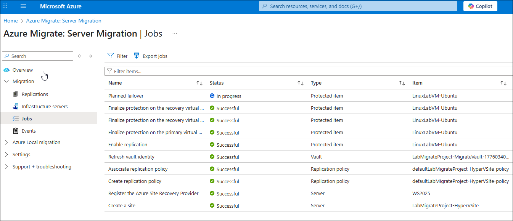
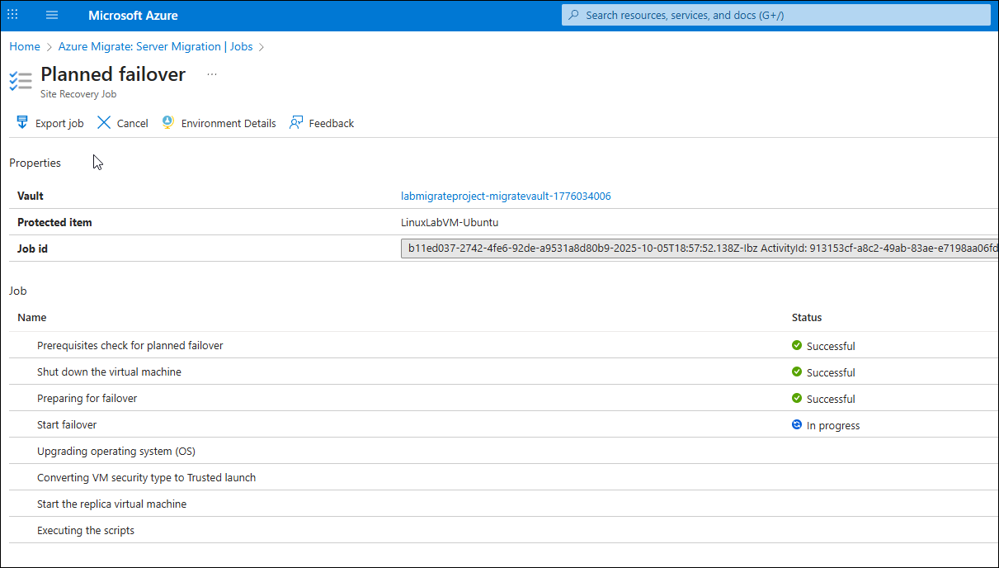
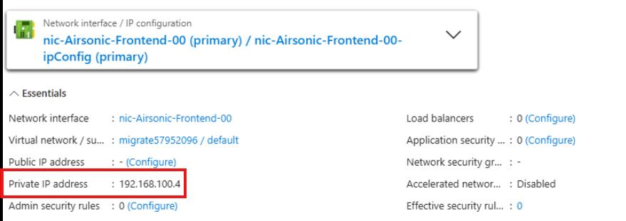

## Task 04: Finalize the migration

### Introduction
Once Terra Firm confirms the pilot VM runs correctly in Azure, there's no need to keep paying for (or managing) replication state. Stopping replication cleans up the migration workflow, and validating the workload end-to-end gives Dennis the proof point the business wants: the app is reachable, functional, and behaving as expected after the move.

### Description
In this task, you'll stop replication for the migrated VM and validate the workload by accessing the Airsonic application hosted on the migrated Azure VM.

### Success criteria
- Replication is stopped and replication state is cleaned up for Airsonic-Frontend.
- The Airsonic application is accessible on the Azure VM and shows expected content.

### Key tasks
- Review migration job completion and confirm planned failover finished successfully.
- Stop replication for the migrated VM to clean up replication state.
- Locate the VM in Azure, record the private IP, and validate application access via browser.

## Stop replication on the migrated VM

1. You can monitor the progress by opening the **Jobs** section on the Migration blade and selecting **Planned failover**.

    

    

	{: .note }
    > When the migration completes, the status will display **Planned failover finished**
 
1. Stop the replication by right-clicking the VM: selecting **Replications**,select **Airsonic-Frontend**, and then select **Stop replication**. This action:

    - Stops replication for the on-premises machine.
    - Removes the machine from the Replicated servers count in the Migration and modernization tool.
    - Cleans up replication state information for the VM.
1. On the **Stop replication** page select **OK**.

## Confirm the migrated VM functionality

1. In the Azure portal, search for and select **Virtual machines**.

	{: .note }
    > You should see the migrated VM running in your inventory.

1. Select the **Airsonic-Frontend** VM.

1. On the left menu, under **Networking**, select **Network settings**.

1. Locate the **Private IP address** and enter it into the text box below: 
	 
     @lab.TextBox(MigratedIP)

     

1. In a new browser tab, connect to **http://@lab.Variable(MigratedIP):8080/airsonic**.

1. Login using **admin** for the username and **admin** for the password.

1. Verify that the playlist that you created prior to the migration appears on the left side.

	{: .note }
    > You are now connected to the airsonic application on the VM that was migrated to Azure. That application is connected to the PGSQL database that you migrated previously.

1. Close the airsonic browser tab.

<!-- 3. To review additional steps to take after the migration has finished, review the [Complete the migration](https://learn.microsoft.com/azure/migrate/tutorial-migrate-hyper-v?view=migrate-classic&tabs=UI#complete-the-migration) documentation, along with the post-migration best practices found in the same document. -->

#### Congratulations! 
You stopped replication to clean up migration state and validated the migrated VM's functionality by successfully accessing the application in Azure.
