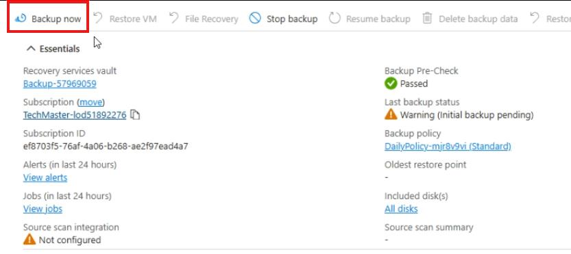

## Task 01: Add-ins - Enable Azure Backup on a migrated VM

### Task purpose
Terra Firm wants better business continuity than they had on-prem-and they want it built in, not bolted on later. Enabling Azure Backup for the migrated VM gives Dennis a fast win: recoverability for accidents, bad deployments, or "that patch did what?!" moments.

### Notes
- Creating a new Recovery Services vault is fine for a lab. In production, vault strategy is often centralized by environment/app/team.
- Wait for the **Enable Backup** deployment to complete before selecting **Backup now**.

1. In the Azure portal, search for and then select **Virtual Machines**.

1. Select the **Airsonic-Frontend** VM.

1. On the left menu, under **Backup + Disaster recovery**, select **Backup**.

1. On the **Welcome to Azure Backup for Azure VMs** page, enter the following:

    | Object | Value |
    | -------- | -------- |
    | Recover Services vault | **Create new** |
    | Backup vault | **Backups-@lab.LabInstance.Id** |
    | Resource group | **AZMigrateRG** |
    | Policy sub type | **Standard** |

1. Select **Enable Backup**.

	{: .note }
    > Wait for the deployment to complete.

1. In the Azure portal, search for and then select **Virtual Machines**.

1. Select the **Airsonic-Frontend** VM.

1. On the left menu, under **Backup + Disaster recovery**, select **Backup**.

1. Select **Backup now**.

	

1. In the **Retain backups till** field, **Select the date two days after today's date**, and then select **OK**.

	{: .note }
    > This triggers an immediate backup of the Airsonic-Frontend VM.

#### Congratulations! 
You enabled Azure Backup for the **Airsonic-Frontend** VM by creating a Recovery Services vault and triggering an **on-demand backup** with a short retention window.
