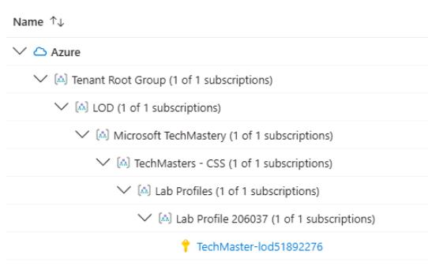

## Task 03: Add-ins - Enable Defender for Cloud on migrated workloads

### Introduction
Terra Firm wants protection that scales as they migrate more workloads-not a manual checklist nobody keeps up with. Turning on Defender for Cloud helps Dennis establish continuous security posture management and threat protection, giving the team a consistent way to spot risks and prioritize fixes after migration.

### Task purpose
Turn on security posture management and threat protection so the VM and database are continuously evaluated against Azure security best practices.

### Notes
- Recommendations may take several minutes to populate after enabling plans. If none appear yet, continue and return later.
- If needed, adjust filters on the Recommendations page (subscription/resource type) to confirm you're viewing the correct scope.

1. In the Azure portal, search for and then select **Defender for Cloud**

1. On the overview page, Locate the **Azure subscriptions** (should show the number 1), and select it.

	

1. Scroll to the bottom of the screen and **Expand the subscription** until you see **TechMaster-lod** subscription.

	

1. Select the **TechMaster-lod** subscription, and then **toggle On** the following Defender plans:

    - Defender CSPM
    - Servers
    - Databases

1. Select **Save**.

1. Return to the **Defender for Cloud** page, and then select **Recommendations**.

1. Evaluate any recommendations that appear.

    {: .warning }
    > It may take several minutes before recommendations appear. If you do not see any, you can continue with the lab and return later.

#### Congratulations! 
You enabled **Defender for Cloud** plans for CSPM, Servers, and Databases and reviewed recommendations that highlight security improvements for the migrated VM and supporting resources.
