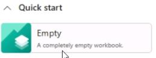
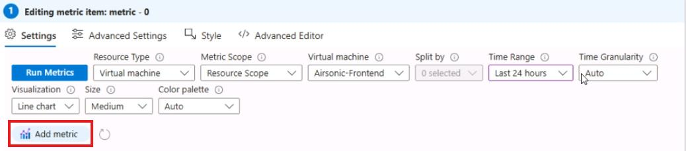
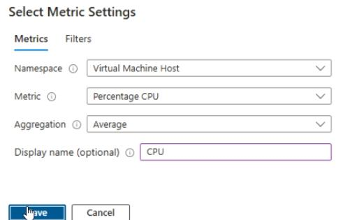
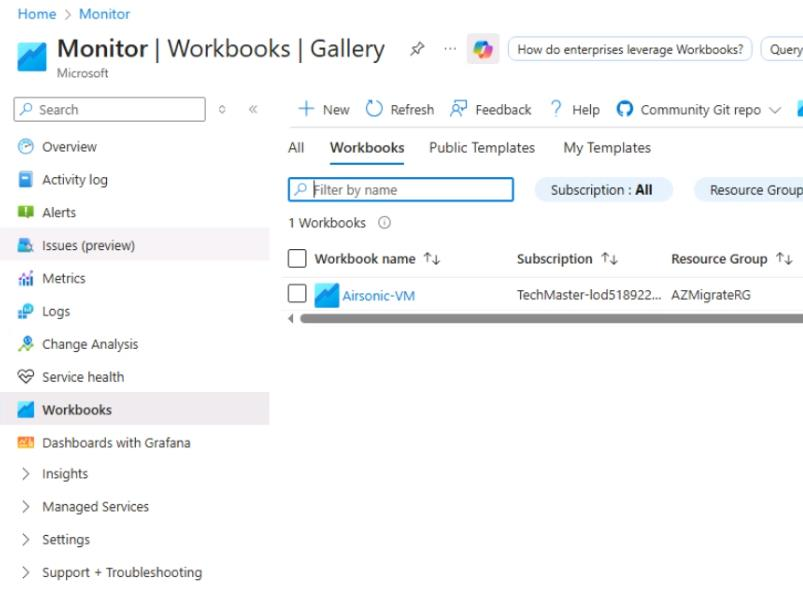

## Task 04: Add-ins - Create Workbook dashboards to visualize resource usage

### Introduction
One of Terra Firm's requirements is visual monitoring-because dashboards make it easier to spot trouble before users do. Building a Workbook gives Dennis's team an at-a-glance view of VM health and utilization, supporting day-2 operations as the pilot workload settles into Azure.

### Task purpose
Create an operational dashboard that provides quick visibility into the health and utilization of the migrated VM.

### Notes
- If **Virtual Machine Host** namespace metrics aren't available in your tenant, try **Virtual Machine** namespace instead.
- **Split by** may remain disabled if the selected metrics do not expose dimensions. That is expected.
- Your charts should reflect **CPU** and **Network In/Out** (not memory).

1. In the Azure portal, search for and then select **Monitor**.

1. On the left menu, select **Workbooks**.

1. Under Quick start, select **Empty** to create a new workbook.

	

1. In the new workbook, select **+ Add > Add metric**.

1. In the Editing metric page, select the following:

    | Object | Value |
    | -------- | -------- |
    | Resource Type | **Virtual machine** |
    | Metric Scope | **Resource Scope** |
    | Virtual machine | **Load all subscriptions Airsonic-Frontend** |
    | Time Range | Last 24 Hours |

1. Select **Add Metric**.

	

1. Add the following:

    | Object | Value |
    | -------- | -------- |
    | Namespace | **Virtual Machine Host** |
    | Metric | **Percentage CPU** |
    | Aggregation | **Average** |
    | Display Name | **CPU** |

    

1. Select **Save**.

1. Select **Add Metric**.

	

1. Add the following:

    | Object | Value |
    | -------- | -------- |
    | Namespace | **Virtual Machine Host** |
    | Metric | **Network In Total** |
    | Aggregation | **Sum** |
    | Display Name | **Network In** |

1. Select **Save**.

1. Select **Add Metric**.

	

1. Add the following:

    | Object | Value |
    | -------- | -------- |
    | Namespace | **Virtual Machine Host** |
    | Metric | **Network Out Total** |
    | Aggregation | **Sum** |
    | Display Name | **Network Out** |

1. Once you have added all three metrics, select **Save**

	

1. In the Save As flyout, enter the following:

    | Object | Value |
    | -------- | -------- |
    | Title | **Airsonic-VM-Monitor-@lab.LabInstance.Id** |
    | Resource Group | **AZMigrateRG** |
    | Location | **@lab.CloudResourceGroup(AZMigrateRG).Location** |

1. Select **Save As**.

1. Observe the resource chart that was created, showing CPU, memory in, and memory out.

	{: .note }
    > You can retrieve this chart in the future by going to Monitor in the portal, selecting Workbooks, and then selecting the workbook that you saved.

    

#### Congratulations! 
You created and saved a **Monitor Workbook** that charts **CPU** and **network traffic** for the **Airsonic-Frontend** VM over the last 24 hours, providing a reusable dashboard for ongoing operations.
