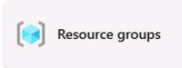
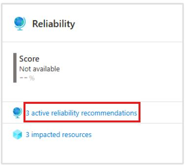

## Task 05: Add-ins - Run cost analysis and apply Advisor recommendations

### Introduction
Terra Firm wants to reduce cost and optimize investments (including Azure Hybrid Benefit), and Dennis will be asked to show receipts. Cost analysis and Advisor recommendations help the team identify what's driving spend and what easy optimizations exist-so the pilot doesn't become the "cloud is expensive" cautionary tale.

### Task purpose
Understand spend and optimization opportunities so you can reduce cost and improve reliability/security post-migration.

### Notes (what to look for)
- In **Cost analysis**, identify the top cost driver (often VM compute) and compare compute vs storage vs backup costs.
- In **Advisor**, capture at least one recommendation (Cost or Reliability are both acceptable if availability is limited).

### Cost analysis

1. In the Azure portal, search for and then select **Cost analysis**.

1. Under Reporting + analytics, select **Cost analysis**.

1. Select **All views > Resource Groups**.

	

1. Select the **AzureMigrateRG** at the bottom of the screen.

1. Observe the **Total** and **Average** resource costs.

	{: .note }
    > Select the individual resources to see their respective costs.

### Advisor recommendations

1. In the Azure portal, search for and then select **Advisor**.

1. On the overview page, observe the various tiles and look for any recommendations.

1. On the Reliability tile, select the **active reliability recommendations**.

	

1. Select the individual  recommendation to observe the details.

    

#### Congratulations! 
You completed this exercise ! You reviewed resource group costs in **Cost Management** and inspected **Advisor** recommendations to identify practical cost and reliability optimizations for the migrated workload.

---

## Summary

So far, you planned and executed a full Azure Migrate workflow for a small Linux application environment and then transitioned the migrated workload into steady-state operations.

You started by creating an Azure Migrate project and registering the Azure Migrate appliance to discover on-premises Hyper-V virtual machines and their workloads. After discovery completed, you reviewed the discovered inventory and grouped related components into an application so you could evaluate the stack as a unit. You then built a business case and reviewed the automatically generated assessment to compare modernization paths (PaaS-preferred, PaaS-only, and lift-and-shift). Using assessment outputs, you created a wave plan to organize the migration sequence and documented an identity mapping strategy from FreeIPA to Microsoft Entra ID.

Next, you performed migrations:
- You migrated the PostgreSQL backend to **Azure Database for PostgreSQL Flexible Server**, validated the migration, and updated the application configuration to point to the new database endpoint.
- You migrated the Airsonic frontend by lift-and-shift to an **Azure VM**, validated application functionality, and confirmed the application successfully connected to the migrated database.

Finally, you applied post-migration governance and operational controls by enabling **Azure Backup**, configuring **Update Manager**, enabling **Defender for Cloud** plans and reviewing recommendations, building an **Azure Monitor Workbook** to visualize VM performance, analyzing costs with **Cost Management** and **Advisor**, and documenting a practical **rollback and disaster recovery strategy** for both the VM and the database platform.

At this point, you have:
- A documented plan and assessment-driven decision trail (business case → assessment → wave plan).
- A working migrated application stack (VM + PaaS database).
- Baseline operational protections (backup, patching, monitoring, security posture, and cost optimization guidance).

This workshop demonstrates how to migrate and modernize the iconic **Spring Boot PetClinic** application from local execution to **Azure AKS Automatic**. You'll experience the complete modernization journey using AI-powered tools such as **GitHub Copilot app modernization** and **Containerization Assist MCP Server**.