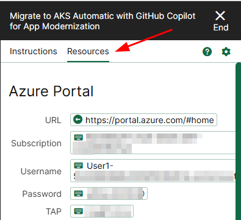
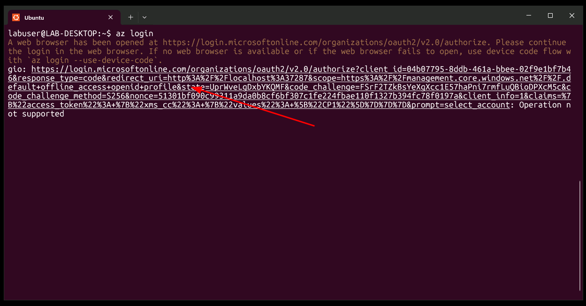
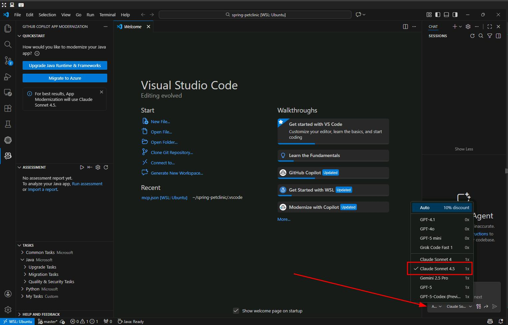

## Task 01: Set up the lab

#### Sign In to Azure

1. Open Microsoft Edge and log into Azure with the credentials in the **Resources** tab: **https://portal.azure.com/**.

    

1. Next, in a terminal window, sign in to use the Azure CLI:

    ```bash
	  az login
    ```
1. Press the `CTRL` key and then select the URL in the terminal. This will open a new tab in Edge.
	
    

1. Pick your user account to finish logging in.

    

1. Back in the terminal window, press **Enter** to select the current subscription.

---

### Install the Service Connector

1. In a terminal window, run the following command to install the service-connector extension:

	  ```bash
	  az extension add --name serviceconnector-passwordless --upgrade
	  ```

1. Create the sevice-connector for postgres-flexible:
	
	  ```bash
	  nohup bash -c 'az aks connection create postgres-flexible --connection pg --source-id @lab.CloudResourceTemplate(LAB502).Outputs[aksClusterId] --target-id @lab.CloudResourceTemplate(LAB502).Outputs[postgresDatabaseId] --workload-identity @lab.CloudResourceTemplate(LAB502).Outputs[userAssignedIdentityId] --client-type none --kube-namespace default | tee ~/spring-petclinic/k8s/sc.json' > ~/spring-petclinic/k8s/sc.log 2>&1 &
	  ```

	{: .note }
    > This script will log its output into the **~/spring-petclinic/k8s/sc.log** file. You can check for its progress opening that file.

<!-- 
{: .note }
> This command will take about 8 minutes to run. To make most of your time on this lab, you can leave it running on this terminal until it finishes. You can open a new tab in the Windows Terminal by selecting on the plus sign and proceed to the next step on this lab.
>  -->

---

### Configure Azure RBAC Authentication for kubectl

Before deploying to AKS, you need to configure `kubectl` to use Azure RBAC authentication.

1. In your terminal window, run the following commands:

  ```bash
  # add Admin to your user
  az role assignment create --assignee @lab.CloudPortalCredential(User1).Username --role "Azure Kubernetes Service RBAC Cluster Admin" --scope  @lab.CloudResourceTemplate(LAB502).Outputs[aksClusterId]

  # Get AKS credentials (this downloads the kubeconfig)
  az aks get-credentials --resource-group  @lab.CloudResourceGroup(myResourceGroup).Name --name @lab.CloudResourceTemplate(LAB502).Outputs[aksClusterName]

  # Configure kubectl to use Azure RBAC authentication
  kubelogin convert-kubeconfig --login azurecli

  # Test AKS access
  kubectl get nodes
  ```

{: .note }
> The `kubelogin convert-kubeconfig --login azurecli` command configures kubectl to use Entra (Azure AD) authentication with the Azure RBAC roles assigned to your user account. This is required for AKS Automatic clusters with Azure RBAC enabled.

---

#### Authenticate GitHub Copilot

To use GitHub Copilot, sign in with the GitHub account provided in your lab environment.

1. In the browser, open **https://github.com/enterprises/skillable-events/sso**

1. Select **Continue**.

	  

1. Log in with the credentials listed in the **Resources** tab.

### Sign in to VS Code with GitHub

After signing in to GitHub, open VS Code and complete the Copilot setup:

1. In your terminal, run the following command to launch a new VS Code instance into the `spring-petclinic` source directory:
   
    ```bash
    cd ~/spring-petclinic
    code .
    ```

1. Select the **account icon** (bottom right), then **Sign in to use Copilot**.

	  

1. Select **Continue with GitHub**.

	  

1. Authorize VS Code to access your GitHub account.

	  

1. Select **Connect**, then **Authorize Visual-Studio-Code**.

	  

1. When prompted, choose to always allow **vscode.dev** to open links.

	  

1. Back in VS Code, open the **GitHub Copilot Chat** window and switch the model to **Claude Sonnet 4.5**.

    
 
 
#### You're ready to begin

Your environment is now configured. Next, you'll verify the local PetClinic application and begin the migration and modernization journey.