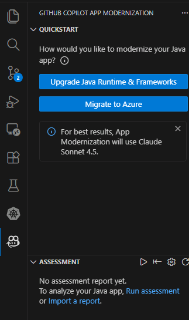
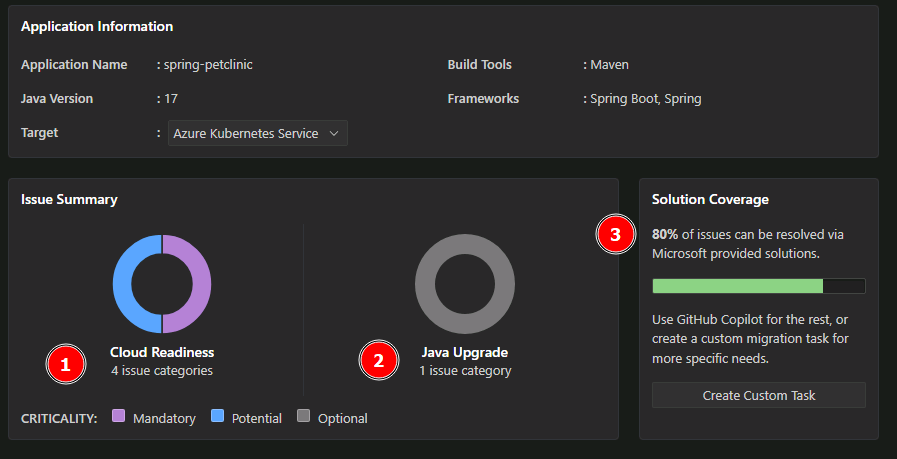

## Task 03: Application modernization

**What you'll do:** Use GitHub Copilot app modernization to assess, remediate, and modernize the Spring Boot application in preparation to migrate the workload to AKS Automatic.

**What you'll learn:** How GitHub Copilot app modernization works, demonstration of modernizing elements of legacy applications, and the modernization workflow.

---

Next, let's begin our modernization work. 

1. Select  `GitHub Copilot app modernization` extension.
	
	

### Execute the assessment

Now that you have GitHub Copilot setup, you can use the assessment tool to analyze your Spring Boot PetClinic application using the configured analysis parameters.

1. Navigate the Extension Interface and select **Migrate to Azure** to begin the modernization process.

  

<!-- 1. Allow the GitHub Copilot app modernization to sign in to GitHub 
	

1. Authorize your user to sign in

	

1. And finally, authorized it again on this screen

	

1. The assessment will start now. Notice that GitHub will install the AppCAT CLI for Java. This might take a few minutes

	 -->

{: .important }
> You can follow the progress of the upgrade by looking at the Terminal in vscode


<!-- Also note that you might be prompted to allow access to the language models provided by GitHub Copilot Chat. Select **Allow**

 -->

### Overview of the assessment

Assessment results are consumed by GitHub Copilot App Modernization (AppCAT). AppCAT examines the scan findings and produces targeted modernization recommendations to prepare the application for containerization and migration to Azure.

- **target**: the desired runtime or Azure compute service you plan to move the app to.
- **capability**: what technology to modernize the apps towards.
- **mode**: the analysis depth AppCAT should use.
- **os**: best practices tailored for specific operating systems that AppCAT should use when migrating applications (windows or Linux). For this lab we will not be focusing on it.

**Targets**

| Target | Description   |
|--|--|
| azure-aks | Best practices for deploying an app to Azure Kubernetes Service.|
| azure-appservice | Best practices for deploying an app to Azure App Service. |
| azure-container-apps | Best practices for deploying an app to Azure Container Apps. |


**Capability**

| Capability | Description |
|--|--|
| containerization | Best practices for containerizing applications. |
| openjdk11 | Best practices for migrating to OpenJDK 11. |
| openjdk17 | Best practices for migrating to OpenJDK 17. |
| openjdk21 | Best practices for migrating to OpenJDK 21. |

**Analysis modes**

| Mode | Description |
|--------|---------|
| issue-only  | analyze source code to only detect issues |
| **source-only** | Fast analysis that examines source code only. |
| **full** | Full analysis: inspects source code and scans dependencies (slower, more thorough). |

{: .important }
> **Where to change these options**
>
> You can customize this report by editing the file at **.github/appmod-java/appcat/assessment-config.yaml** to change targets and modes.
>
> For this lab, AppCAT runs with the following configuration:
>
>```yaml
>appcat:
>  - target:
>      - azure-aks
>      - azure-appservice
>      - azure-container-apps
>    mode: issue-only
>```
>
>If you want a broader scan (including dependency checks) change `mode` to `full`, or add/remove entries under `target` to focus recommendations on a specific runtime or Azure compute service.

### Review the assessment results

After the assessment completes, you'll get a success message in the GitHub Copilot chat summarizing what was accomplished:



The assessment analyzed the Spring Boot Petclinic application for cloud migration readiness and identified the following:

**Key findings**:

  * 4 cloud readiness issues requiring attention (1)
  * 1 Java upgrade opportunity for modernization (2)

**Resolution approach:** More than 80% of the identified issues can be automatically resolved through code and configuration updates using GitHub Copilot's built-in app modernization capabilities (3).

**Issue prioritization:** Issues are categorized by urgency level to guide remediation efforts:

* Mandatory (Purple) - Critical issues that must be addressed before migration.
* Potential (Blue) - Performance and optimization opportunities.
* Optional (Gray) - Nice-to-have improvements that can be addressed later.

This prioritization framework ensures teams focus on blocking issues first while identifying opportunities for optimization and future enhancements.

### Review specific findings

Select individual issues in the report to see detailed recommendations. In practice, you would review all recommendations and determine the set that aligns with your migration and modernization goals for the application.

{: .note }
> For this lab, you'll spend your time focusing on one modernization recommendation: updating the code to use modern authentication via Azure Database for PostgreSQL Flexible Server with Entra ID authentication.


| Aspect | Details |
|--------|---------|
| **Modernization Lab Focus** | Database Migration to Azure PostgreSQL Flexible Server |
| **What was found** | PostgreSQL database configuration using basic authentication detected in Java source code files |
| **Why this matters** | External dependencies like on-premises databases with legacy authentication must be resolved before migrating to Azure |
| **Recommended solution** | Migrate to Azure Database for PostgreSQL Flexible Server |
| **Benefits** | Fully managed service with automatic backups, scaling, and high availability |
