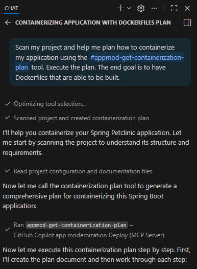

## Task 05: Generate containerization assets with AI

**What you'll do:** Use AI-powered tools to generate Docker and Kubernetes manifests for your modernized Spring Boot application.

**What you'll learn:** How to create production-ready containerization assets - including optimized Dockerfiles and Kubernetes manifests configured with health checks, secrets, and workload identity.

---

### Using containerization assist

In the GitHub Copilot agent chat, use the following prompt to generate Docker and Kubernetes manifests.

```
/petclinic Help me containerize the petclinic application in this repo
```

The GitHub Copilot for App Modernization will analyze your repository and generate:

- **Dockerfile**: Multi-stage build with optimized base image

- **Kubernetes Deployment**: With Azure workload identity, PostgreSQL secrets, health checks, and resource limits

- **Kubernetes Service**: LoadBalancer configuration for external access

**Expected Result**: Kubernetes manifests in the `k8s/` directory.




{: .note }
> To expedite your lab experience, you can allow the Containerization Assist MCP server to run on this Workspace. Select **Allow in this Workspace** or **Always Allow**.
> 
> 
>
> You'll also need to allow the MCP server to make LLM requests. 
> 
> Select **Always**.
> 
> 


{: .highlight }
> You are almost there. You'll deploy the AI generated files, but they might need some tuning later. Before deploying it to your cluster, double check the image location, the use of workload identity and if the service connector secret reference in the deployment file are correct to your environment.

### Build and push container image to ACR

Copilot will build the containerized application and push it to your Azure Container Registry. In the Copilot Chat, type this prompt:

Next, In your terminal window, login to ACR using the Azure CLI:

```bash
az acr login --name @lab.CloudResourceTemplate(LAB502).Outputs[acrName]  
```

Then build the Docker image in Azure Container Registry:

```bash
az acr build -t petclinic:0.0.1 . -r @lab.CloudResourceTemplate(LAB502).Outputs[acrName]
```
